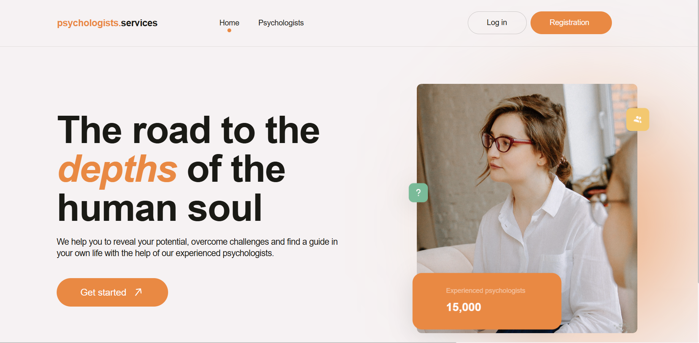
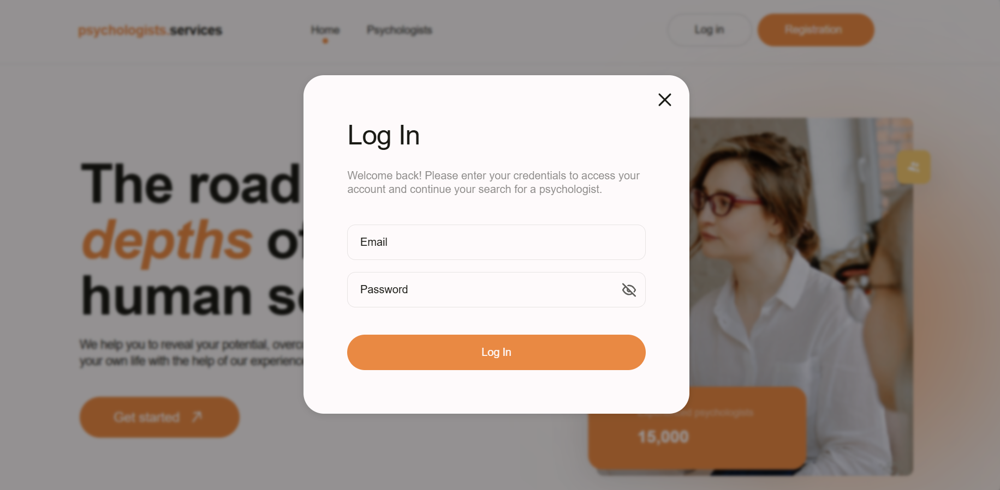
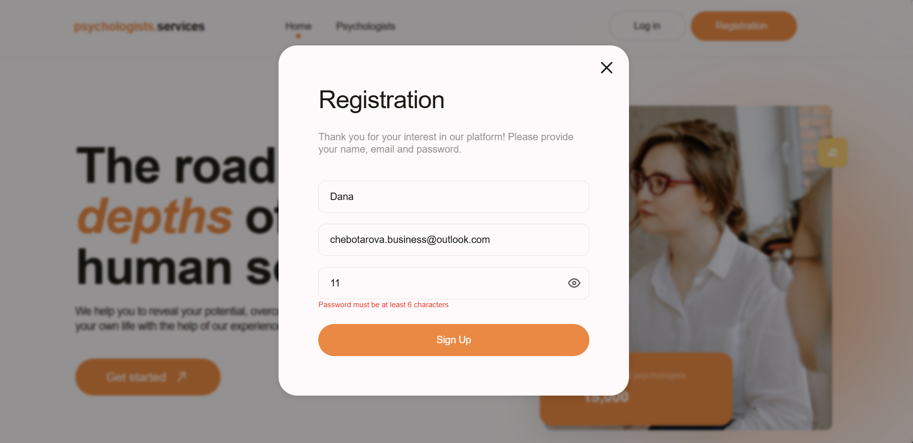
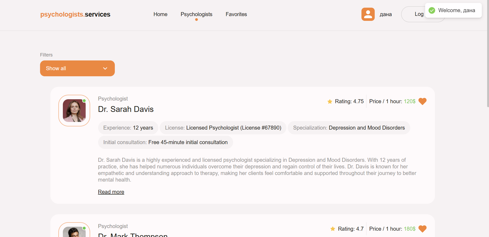
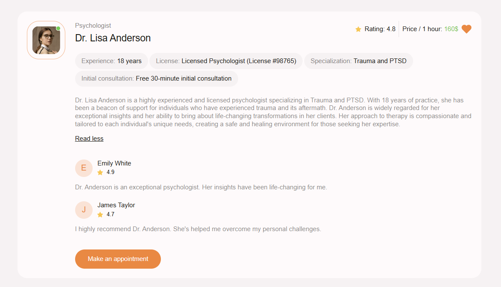
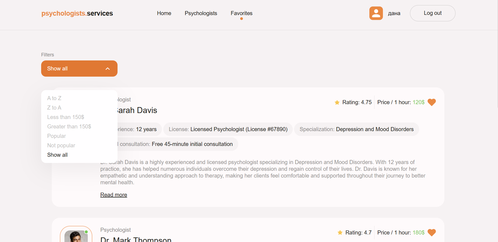
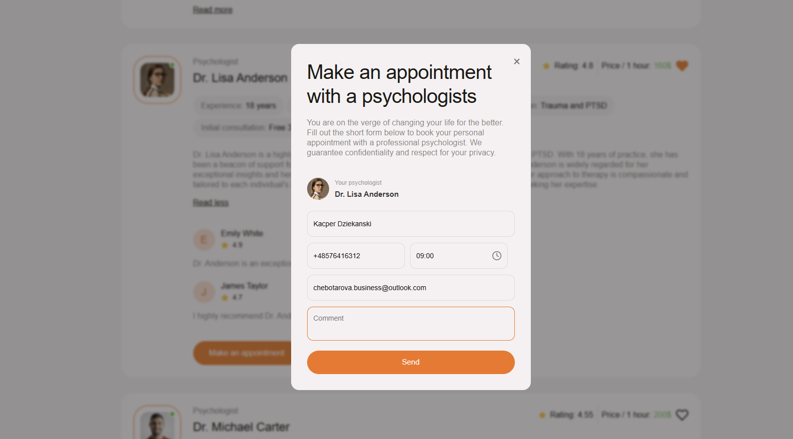

# 🌿 Psychologists Services

Modern web platform for finding psychologists, exploring detailed profiles, managing favorites, and booking appointments online.

### 🔗 Live demo

👉 **https://psychologists-hx65.vercel.app/favorites**

---

## 🚀 Features

### 🔐 Authentication

- Firebase email/password auth
- Auto-login listener
- Private & restricted routes

### 🧠 Psychologists Directory

- Dynamic list from server
- Detailed psychologist cards
- “Read more / Read less” descriptions
- Rating, price, experience, specialization

### ❤️ Favorites

- Add/remove favorites
- Persistent with Redux Persist

### 🔎 Filtering & Sorting

- A → Z / Z → A
- Price filters
- Popular / Not popular
- Show all

### 📅 Appointment Modal

- React Hook Form
- Yup validation
- Time picker
- Controlled inputs
- Toast notifications

### 🎨 UI

- CSS Modules
- Loader
- Responsive layout
- Smooth animations

---

## 🛠️ Tech Stack

| Category      | Tools                        |
| ------------- | ---------------------------- |
| Framework     | React 19, Vite               |
| Routing       | React Router v7              |
| State         | Redux Toolkit, Redux Persist |
| Forms         | React Hook Form + Yup        |
| Auth          | Firebase Authentication      |
| Notifications | React Hot Toast              |
| Styling       | CSS Modules                  |
| Deployment    | Vercel                       |

---

## 📂 Project Structure

```txt
src
│  App.jsx
│  main.jsx
│  index.css
│
├─assets/
├─components/
│    AppointmentForm/
│    AppointmentModal/
│    AuthForm/
│    Container/
│    FilterDropdown/
│    HeroImg/
│    HeroTab/
│    ImgWrap/
│    Loader/
│    Logo/
│    Modal/
│    PeopleBlock/
│    PsychologistCard/
│    PsychologistsList/
│    QuestionBlock/
│
├─constants/
├─firebase/
├─icons/
├─layout/
├─pages/
├─redux/
└─services/
```

## 📸 Screenshots

All images are stored in `/public/screenshots/`.
The gallery below shows the main user flows of the application.

<table>
  <tr>
    <td align="center">
      <strong>Home Page</strong><br />
      
    </td>
    <td align="center">
      <strong>Login Modal</strong><br />
      
    </td>
  </tr>
  <tr>
    <td align="center">
      <strong>Registration Modal</strong><br />
      
    </td>
    <td align="center">
      <strong>Psychologists List</strong><br />
      
    </td>
  </tr>
  <tr>
    <td align="center">
      <strong>Psychologist Details</strong><br />
      
    </td>
    <td align="center">
      <strong>Favorites Page</strong><br />
      
    </td>
  </tr>
  <tr>
    <td align="center">
      <strong>Appointment Modal</strong><br />
      
    </td>
    <td align="center">
      <strong>404 Page</strong><br />
      
    </td>
  </tr>
</table>
```

## 📦 Installation & Scripts

### Install dependencies

```bash
npm install
```

### Run development server

```bash
npm run dev
```

### Build for production

```bash
npm run build
```

### Preview production build

```bash
npm run preview
```
